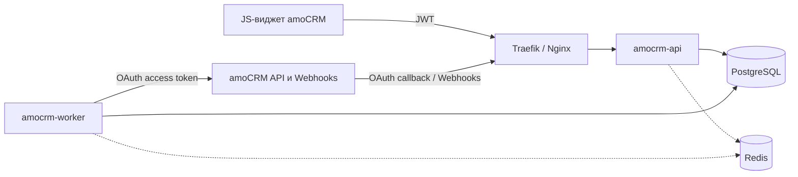

Готовый подробный план в формате Markdown:

[Скачать `amocrm-go-backend-plan.md`](sandbox:/mnt/data/amocrm-go-backend-plan.md)

Документ можно использовать как основу для `README.md`, технического задания или архитектурной документации проекта. В нём есть архитектура, SQL-схемы, маршруты API, пример Go-handler для Webhooks, очередь задач, безопасность, мониторинг, тестирование и поэтапный roadmap.

# Основная архитектура

Для первой production-версии я рекомендую **два независимо запускаемых Go-сервиса**:

```text
amocrm-api
amocrm-worker
```

Балансировщик при этом не является Go-микросервисом:

```text
Traefik / Nginx / Cloud Load Balancer
```

Общая схема:



## `amocrm-api`

Публичный сервис:

* OAuth callback;
* запросы из JS-виджета;
* проверка одноразового JWT amoCRM;
* приём Webhooks;
* настройки интеграции;
* создание фоновых задач;
* получение статуса задач;
* собственная авторизация панели управления.

## `amocrm-worker`

Внутренний сервис:

* обращения к amoCRM API;
* обновление OAuth-токенов;
* регистрация Webhooks;
* разбор и обработка событий;
* синхронизация;
* workflow;
* retry;
* rate limiting;
* фоновые задачи.

## PostgreSQL

Используется как:

* основное хранилище;
* хранилище OAuth credentials;
* durable inbox для Webhooks;
* очередь jobs;
* audit log;
* хранилище результатов workflow.

## Redis

На старте опционален. Нужен при горизонтальном масштабировании для:

* защиты от повторного использования `jti`;
* распределённого rate limiting;
* короткого кэша;
* некоторых distributed locks.

---

# Как Webhooks входят в архитектуру

Взаимодействие делится на две разные операции.

## 1. Регистрация Webhook

Worker делает авторизованный запрос к amoCRM:

```http
POST https://{account_domain}/api/v4/webhooks
Authorization: Bearer {access_token}
Content-Type: application/json
```

```json
{
  "destination": "https://hooks.example.com/hooks/amocrm/v1/SECRET",
  "settings": [
    "add_lead",
    "update_lead",
    "status_lead",
    "delete_lead",
    "add_contact",
    "update_contact"
  ]
}
```

Для работы с Webhooks API используются:

```http
GET    /api/v4/webhooks
POST   /api/v4/webhooks
DELETE /api/v4/webhooks
```

Методы управления Webhooks доступны с правами администратора аккаунта. В одном аккаунте может быть до 100 Webhooks, при этом один URL можно подписать сразу на несколько событий. ([amoCRM][1])

Практически лучше регистрировать:

```text
одна установка amoCRM
    =
один Webhook URL
    +
массив всех нужных событий
```

А не делать отдельный URL для каждого типа события.

## 2. Получение Webhook

amoCRM отправляет запрос в `amocrm-api`:

```http
POST /hooks/amocrm/v1/{webhook_key}
Content-Type: application/x-www-form-urlencoded
```

Например:

```text
leads[update][0][id]=123456
&leads[update][0][status_id]=142
&leads[update][0][last_modified]=1710000000
&account[id]=987654
```

Стандартные CRM Webhooks приходят как `x-www-form-urlencoded`, а не как JSON. ([amoCRM][2])

Обработка:

```text
amoCRM
    ↓
Traefik / Nginx
    ↓
amocrm-api
    ↓
проверка webhook_key
    ↓
сохранение raw body в PostgreSQL
    ↓
создание job
    ↓
HTTP 204
    ↓
amocrm-worker
    ↓
разбор и нормализация события
    ↓
выполнение бизнес-логики
```

amoCRM ждёт ответ от Webhook endpoint не более **двух секунд**. Успешным считается HTTP-код в диапазоне `100–299`. При неуспешной доставке предусмотрены повторные попытки; большое количество невалидных ответов может привести к отключению Webhook. ([amoCRM][2])

Поэтому внутри Webhook handler нельзя:

```text
- обращаться к amoCRM API;
- вызывать сторонний сервис;
- синхронизировать сущности;
- выполнять workflow;
- отправлять сообщения;
- ждать завершения бизнес-операции.
```

Handler должен успеть только:

```text
1. Найти installation по webhook_key.
2. Ограничить размер body.
3. Прочитать raw body.
4. Проверить account ID.
5. Сохранить delivery и job в одной транзакции.
6. Вернуть 204.
```

Если PostgreSQL недоступен, лучше вернуть:

```http
HTTP/1.1 503 Service Unavailable
```

Тогда amoCRM сможет повторить доставку. Возвращать `204`, не сохранив событие, опасно: Webhook будет считаться доставленным, но событие потеряется.

---

# Защита Webhook endpoint

Рекомендуемый URL:

```text
https://hooks.example.com/hooks/amocrm/v1/{webhook_key}
```

`webhook_key` создаётся отдельно для каждой установки:

```go
const secretSize = 32

secret := make([]byte, secretSize)

if _, err := rand.Read(secret); err != nil {
    return err
}
```

В базе желательно хранить:

```text
SHA-256(webhook_key)
```

Для повторной регистрации или ротации исходный ключ можно хранить отдельно в зашифрованном виде.

В документации стандартных CRM Webhooks не указана HMAC-подпись запроса. Поэтому такой запрос архитектурно следует считать неподписанным и защищать секретным URL, проверкой аккаунта, ограничением размера, rate limiting и дедупликацией. Формат стандартной доставки описан amoCRM как `x-www-form-urlencoded`. ([amoCRM][2])

`account[id]` не является секретом. Его нужно использовать только как дополнительную проверку:

```text
installation.account_id == webhook.account_id
```

---

# Дедупликация Webhooks

Из-за повторных доставок одно событие может прийти несколько раз.

Один HTTP-запрос также может содержать сразу несколько событий:

```text
WebhookDelivery
    ├── InboxEvent 1
    ├── InboxEvent 2
    └── InboxEvent 3
```

Для каждого события создаётся ключ:

```text
SHA-256(
    installation_id +
    entity_type +
    event_type +
    entity_id +
    event_timestamp +
    normalized_payload_hash
)
```

И ограничение:

```sql
UNIQUE (installation_id, deduplication_key)
```

При этом сама бизнес-операция тоже должна быть идемпотентной. Например, перед обновлением сделки Worker сравнивает текущее и желаемое состояние:

```text
если значение уже установлено
    → ничего не отправляем в amoCRM
```

Это одновременно защищает от дубликатов и циклов:

```text
Webhook update_lead
    → Worker обновляет lead
    → приходит новый update_lead
    → Worker снова обновляет lead
```

---

# OAuth и токены

Authorization code amoCRM действует ограниченное время — в официальной документации указан срок 20 минут. При обмене backend получает `access_token`, `refresh_token` и `expires_in`; время жизни access token нельзя хардкодить. Refresh token можно обменять только один раз, а при отсутствии обновления в течение трёх месяцев потребуется повторная авторизация. ([amoCRM][3])

Поэтому обновление токена должно выполняться под блокировкой:

```sql
BEGIN;

SELECT *
FROM oauth_credentials
WHERE installation_id = $1
FOR UPDATE;

-- Повторно проверить expires_at.
-- Выполнить refresh.
-- Сохранить новую пару токенов.

COMMIT;
```

Алгоритм:

```text
1. Worker видит, что access token скоро истечёт.
2. Получает lock по installation_id.
3. Повторно читает token_version и expires_at.
4. Проверяет, не обновил ли токен другой Worker.
5. Вызывает /oauth2/access_token.
6. Сохраняет новую пару access/refresh.
7. Увеличивает token_version.
8. Освобождает lock.
```

При `401`:

```text
один принудительный refresh
    ↓
один повтор исходного запроса
    ↓
если снова 401 — reauth_required
```

Бесконечно повторять `401` нельзя.

---

# Авторизация запросов виджета

Для запросов из интерфейса amoCRM можно использовать одноразовый JWT, который добавляется авторизованным методом Web SDK.

amoCRM документирует подпись HS256 и claims:

```text
iss
aud
jti
iat
nbf
exp
account_id
user_id
client_uuid
```

Backend должен проверить подпись, сроки, `aud`, `iss`, `client_uuid`, а также запретить повторное использование `jti`. ([amoCRM][4])

После проверки создаётся серверный контекст:

```go
type WidgetPrincipal struct {
    AccountID  int64
    UserID     int64
    ClientUUID string
    Issuer     string
    TokenID    string
}
```

Installation определяется только по проверенным claims:

```text
client_uuid + account_id
```

`account_id` из JSON запроса доверять нельзя.

---

# Очередь задач

Для MVP отдельный брокер сообщений необязателен. Можно использовать PostgreSQL:

```sql
SELECT id
FROM jobs
WHERE status IN ('queued', 'retry')
  AND run_after <= now()
  AND (locked_until IS NULL OR locked_until < now())
ORDER BY priority, run_after, created_at
FOR UPDATE SKIP LOCKED
LIMIT 10;
```

Основные статусы:

```text
queued
processing
retry
completed
failed
dead
cancelled
```

Job должен иметь lease:

```text
locked_by
locked_until
```

Если Worker упал, после истечения `locked_until` задача снова становится доступной.

Пример типов задач:

```text
oauth.refresh_token

webhook.reconcile
webhook.parse
webhook.process_event

amocrm.get_lead
amocrm.update_lead
amocrm.add_note
amocrm.create_task

sync.account
sync.leads
sync.contacts

workflow.execute
```

---

# Rate limiting amoCRM

Официальная документация указывает ограничения до 7 запросов в секунду на одну интеграцию и до 50 запросов в секунду на аккаунт. При превышении возвращается `429`; повторные нарушения могут привести к `403`. ([amoCRM][5])

При одном Worker можно использовать in-memory token bucket.

При нескольких Worker limiter должен быть общим:

```text
Redis:
ratelimit:integration:{client_uuid}
ratelimit:account:{account_id}
```

Обработка ответов:

| Ответ | Действие                                         |
| ----- | ------------------------------------------------ |
| `401` | refresh и один повтор                            |
| `402` | зафиксировать ограничение подписки               |
| `403` | остановить операцию и проверить права/блокировку |
| `422` | permanent validation error                       |
| `429` | retry с backoff                                  |
| `5xx` | retry с backoff                                  |

---

# Порядок реализации

1. Создать `cmd/api` и `cmd/worker`.
2. Подключить PostgreSQL и миграции.
3. Реализовать installations и OAuth.
4. Добавить зашифрованное хранение токенов.
5. Реализовать refresh под блокировкой.
6. Написать единый amoCRM HTTP client.
7. Реализовать регистрацию и reconcile Webhooks.
8. Добавить durable Webhook inbox.
9. Реализовать PostgreSQL jobs и Worker.
10. Добавить проверку одноразового JWT виджета.
11. Реализовать actions и получение статуса jobs.
12. Добавить rate limiting, метрики и аудит.
13. Протестировать дубликаты, падение Worker и одновременный refresh.
14. Подготовить production deployment.

Итоговая минимальная конфигурация:

```text
Traefik/Nginx
2 × amocrm-api
1 × amocrm-worker
PostgreSQL
Redis при горизонтальном масштабировании
```

Это не набор из десятков формальных микросервисов, а практичная архитектура из двух независимо масштабируемых приложений: публичного ingress/API и фонового Worker.

[1]: https://www.amocrm.ru/developers/content/crm_platform/webhooks-api "Вебхуки"
[2]: https://www.amocrm.ru/developers/content/crm_platform/webhooks-format "Webhooks"
[3]: https://www.amocrm.ru/developers/content/oauth/step-by-step "Пример по шагам"
[4]: https://www.amocrm.ru/developers/content/oauth/disposable-tokens "Одноразовые токены для интеграций"
[5]: https://www.amocrm.ru/developers/content/api/recommendations "Ограничения и рекомендации"
