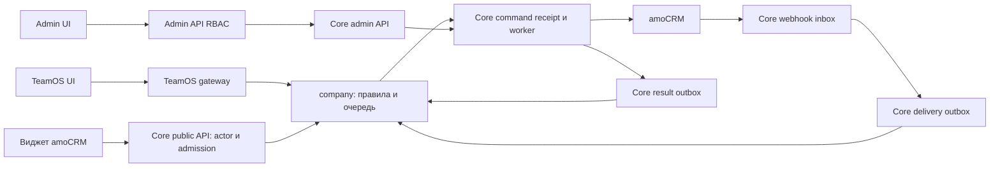

# РС-01.2. Владение данными, потоки и права

Дата: 2026-10-01. Документ закрывает проектную часть РС-01.2.1 и
РС-01.2.2. Это спецификация для следующих этапов, не описание готового
распределителя. «Предлагается» означает инженерное решение к рассмотрению,
а не согласование заказчиком. Подтверждённое бизнес-требование: сохранять
доступного текущего ответственного при включённой отключаемой настройке.

Архитектурное предложение вынесено в
[ADR-0032](../../adr/0032-lead-distribution-ownership-and-access.md).
Правила выбора и пилот дополняются соседними документами этого пакета.

## 1. Проверенная база и разрывы

| Факт в текущем коде | Следствие для распределения |
| --- | --- |
| `company` TeamOS содержит CRUD групп, события и симуляцию; проверки включают `companyId` | Расширять этот домен реальной очередью; симуляция не является CRM-назначением |
| Core имеет installation, OAuth, inbox, jobs, effects, capability admission | Использовать эти технические механизмы через узкие порты |
| Webhook registry разрешает один router на пару entity/event; `leadstatus` регистрирует `leads:status` | Нужен fanout с независимой durable доставкой; второй router сейчас вызовет panic |
| `LeadState` содержит ID, pipeline и status; клиент меняет статус | Ответственный, версия наблюдения и его изменение требуют нового контракта |
| Activity проверяет live admin, scoped delegation и текущую Core policy | Это образец, а не готовое разрешение нового продукта или ACL обычного сотрудника |
| TeamOS имеет `company_integrations`, `amo_account_id`, external ID сотрудников | Это исходные привязки; подтверждённого контракта с installation Core ещё нет |
| Admin API имеет viewer/operator/admin и серверный RBAC | Новые права и команды нужно явно добавить; SQL к БД другого владельца запрещён |
| Виджет активности — локальный прототип с AMD/UMD loader | Можно переиспользовать lifecycle подход; production auth/API распределения ещё нет |

Код и источники проверяемых фактов:

- [TeamOS distribution][teamos-distribution], [роли][teamos-roles],
  [привязки компаний][teamos-binding], [импорт сотрудников][teamos-users].
- [Core router][core-router], [leadstatus registration][core-leadstatus],
  [CRM client][core-leads], [widget JWT][core-widgetauth],
  [policy][core-policy], [catalog][core-catalog].
- [Admin RBAC][admin-rbac], [правила админки][admin-guide],
  [прототип виджета][widget-prototype].

## 2. Владельцы данных и границы компонентов

Предлагаемая матрица system of record:

| Данные / решение | Единственный владелец | Допустимые копии и обращения |
| --- | --- | --- |
| Компания, TeamOS UUID сотрудника, роль, доступ к разделам | TeamOS `company` | Минимальные проверенные identity в запросе; никаких копий ролей как вечного разрешения |
| Графики, исключения, часовой пояс | TeamOS `company` | В решении сохраняется версия/снимок условий; интерфейсы читают API |
| Группы, порядок, привязка правила к этапу, сохранение ответственного | TeamOS `company` | Core получает только необходимую ревизию/область команды |
| Доступность, решение и бизнес-очередь ожидания, позиция round-robin | TeamOS `company` | Core не выбирает получателя и не рассчитывает график |
| История бизнес-решений и итог распределения | TeamOS `company` | Результат Core — подтверждение технического эффекта; UI читает проекцию TeamOS |
| Интеграция, installation, домен, OAuth, refresh, capability | Core | Ни UI, ни TeamOS не получают OAuth или client secret |
| Приём webhook, raw delivery, нормализованный inbox | Core | Минимальное событие передаётся через outbox; это не общая БД CRM Events |
| Outbox события/результата Core → TeamOS, технические попытки доставки | Core | TeamOS подтверждает durable приём своим inbox |
| Outbox команды TeamOS → Core и входящий результат | TeamOS `company` | Core принимает команду своим receipt/inbox; нет общей транзакции |
| CRM-команда, техническая очередь, lease, effect, результат API | Core | TeamOS хранит operation ID и подтверждённый результат; polling scoped |
| Binding company ↔ installation для распределения | TeamOS `company` | Core хранит проверенное подтверждение binding ID/revision и возможность отзыва |
| Сессии сотрудников админки, RBAC, аудит действий оператора | Admin API | Core получает scoped operator context и безопасный actor для аудита |
| Истинный этап и ответственный сделки | amoCRM | Оба backend хранят наблюдения с временем; локальная копия не доказательство текущего состояния |

Бизнес-очередь и техническая очередь различаются: «ждёт смены» рассчитывает
TeamOS; сетевой retry, rate limit и неизвестный результат PATCH обрабатывает
Core. Один технический retry не создаёт нового бизнес-решения.

Размещение первой версии: существующие Core API/worker и TeamOS `company`
через явный distribution bridge. Bridge — адаптер доставки и policy, а не
второй распределитель. Новые таблицы имеют владельца и миграции этого
владельца. Не добавлять Redis, общий SQL, новый брокер или микросервис по
умолчанию. Существующий NATS TeamOS остаётся внутренним механизмом TeamOS.

Правила [ADR-0012][module-contract] сохраняются: узкие DTO/порты, отсутствие
импортов чужих реализаций и SQL handles через границу. Если позже появится
отдельный продуктовый процесс, он потребует своей БД, миграций и адаптеров;
это не предрешено текущей схемой. Bridge не маскируется под Activity и не
получает её grants. Названия новых capabilities/actions пока проектные.

## 3. Подтверждение связи и миграция идентификаторов

Предлагается binding с `bindingId`, `bindingRevision`, `companyId`,
`installationId`, `integrationId`, `accountId`, состоянием и аудитом.
Компания и installation находятся по серверным данным, не принимаются на
веру из JSON браузера. В пилоте одна активная installation распределения
на компанию/account. Старая интеграция может продолжать другие функции.

Последовательность первичного связывания:

1. Активный owner/admin TeamOS создаёт краткоживущее одноразовое намерение
   связывания для своей компании. Сервер фиксирует автора, срок и nonce.
2. В виджете Core проверяет disposable JWT, installation, capability и live
   активного amoCRM admin. Он подтверждает account/integration намерения
   через защищённый server-to-server канал.
3. TeamOS сверяет company/account с существующей регистрацией. При
   несовпадении возвращает конфликт без изменения компании или сотрудников.
4. TeamOS сохраняет binding и исходящую запись в своей транзакции; Core
   идемпотентно сохраняет подтверждение. До двухстороннего подтверждения
   binding остаётся pending, распределение выключено.
5. Изменение installation/повторная привязка — новая revision с аудитом;
   старые команды не получают новый scope автоматически. Отзыв/пауза
   блокирует новые операции; уже отправленные требуют сверки результата.

Точный wire формат и процедуры reconciliation определяются РС-02/РС-03.
Это требование к подтверждению, а не имеющийся готовый endpoint.

Существующий `company_integrations` с provider `rakurs` и `amo_account_id`
не заменяется новой компанией. При смене источника сотрудников:

- Сверять account до импорта; ключ — company + подтверждённый account +
  CRM user ID, а не один глобальный числовой user ID.
- Сохранять UUID TeamOS, графики, исключения, членство и историю.
- Старый `external_id` использовать как исходное сопоставление; неоднозначные
  совпадения и конфликт email показывать для разрешения, без автослияния.
- Не создавать дубликат только из-за смены provider и не повышать роль по
  факту наличия CRM ID. Существующий bootstrap amo admin — отдельный путь;
  distribution bridge не вызывает его для обычного пользователя.
- Отсутствие пользователя считать удалением только после полного успешного
  snapshot; ошибка/неполная страница не снимает сотрудников со смены.
- Непроверенное сопоставление исключает назначение с понятной причиной.

## 4. Потоки и серверные проверки

### TeamOS UI

Сессия/JWT TeamOS → gateway → `company`. `companyId`, actor и роль берутся
из доверенного контекста. Перед чтением/изменением новой очереди `company`
проверяет текущую активность пользователя, роль/section access, принадлежность
объекта компании и binding. Запрос UI не имеет права выбрать произвольную
installation для CRM-вызова. Серверные данные дополняют версионированный
OpenAPI TeamOS аддитивно; существующие camelCase и UUID сохраняются.

### Виджет amoCRM

`$authorizedAjax()` → Core: подпись, issuer/audience, account/client/user,
срок и replay disposable JWT → активные integration/installation и capability
→ live actor policy → scoped bridge → актуальная политика TeamOS.

Core передаёт короткую подписанную делегацию с audience/action, account,
installation/integration, binding revision, CRM actor и корреляцией. TeamOS
находит свой user UUID и роль; клиентский `role=admin` игнорируется. Транспорт
защищён TLS и аутентификацией конкретного сервиса; URL/секрет не берётся из
браузера. Требуется явный контракт нового principal, а не переиспользование
Activity user/admin grants с расширенным смыслом.

Правило свежести для проектирования — по образцу ADR-0011: новый browser
запрос/асинхронная доставка получает новую делегацию; снимок роли ограничен
сроком, Core policy проверяется при каждом переходе. Долгая работа не хранит
browser JWT. Роль, отозванная после выпуска короткой делегации, может иметь
ограниченное окно до её истечения; мгновенный отзыв снимка не обещается.

### События, назначение и результат

1. Webhook ingress проверяет account и сохраняет delivery/job до `2xx`.
   Внешний вызов TeamOS внутри ingress запрещён.
2. После нормализации Core фиксирует per-consumer delivery. У `lead-status`
   и `lead-distribution` собственные состояния, retry и dead-letter причина.
   Отказ одного потребителя не отменяет успешную обработку другого.
3. TeamOS durable inbox дедуплицирует событие, обновляет очередь и сохраняет
   решение/command outbox в своей транзакции. Назначение связывается с
   конкретным входом сделки на этап, а не навсегда с lead ID.
4. Core проверяет service principal, binding revision, scope, capability и
   команду. Command ID + scope + payload hash даёт один receipt; другой payload
   с тем же ID — конфликт. При недоступной policy мутация не выполняется.
5. Worker получает свежую сделку через общий исходящий бюджет, проверяет
   ожидаемый этап/ответственного, сохраняет intent, выполняет PATCH и сверку.
   Capability и binding проверяются перед эффектом. UI не задаёт финальное
   решение о допуске только своим отображённым состоянием.
6. Core сохраняет результат и outbox; TeamOS принимает его идемпотентно,
   завершает решение и продвигает round-robin по бизнес-правилам. Потерянное
   уведомление восстанавливается scoped чтением operation ID.

GET и PATCH не атомарны: ручная смена ответственного между ними возможна.
Precondition и последующая сверка обнаруживают часть конфликтов, но не
доказывают отсутствие промежуточной перезаписи. Не заявлять exactly-once
внешнего эффекта или абсолютную защиту от гонки. Неизвестный исход требует
сверки, а новый получатель запрещён до выяснения предыдущей попытки.

### Админка

Admin UI → собственная сессия/CSRF → Admin API RBAC → внутренний Core admin
listener → прикладной владелец. `X-Admin-Actor` нужен для аудита, сам по себе
не заменяет аутентификацию. Оператор админки не становится amoCRM user.
Диагностика не раскрывает OAuth, webhook secret URL, сырые payload и PII.
Данные выводятся как observation с `observed_at` и отдельными состояниями
unknown/stale/unavailable. Нельзя показывать отсутствующие данные как ноль.

## 5. Матрица пользовательских прав

Ниже целевая политика первой версии; новые checks ещё предстоит реализовать.
Управляющий распределением — существующий TeamOS owner/admin; новая роль
«менеджер» этим документом не вводится.

| Действие | TeamOS employee | TeamOS owner/admin | Виджет: CRM user + TeamOS employee | Виджет: CRM user + TeamOS owner/admin |
| --- | --- | --- | --- | --- |
| Список групп / базовое состояние | С section access `distribution` | Да, своей компании | С тем же section access | Да, связанной компании |
| Новые CRM-поля очереди и подробности сделки | Только `CanViewLead=allow` | Только `CanViewLead=allow` | Только `CanViewLead=allow` | Только `CanViewLead=allow` |
| Изменение группы/порядка/настройки сохранения | Нет | Да | Нет | Да, при подтверждённой роли TeamOS |
| Редактирование графиков | По существующей политике графиков | По существующей политике графиков | Нет | Переход в TeamOS; его серверная политика |
| Пауза группы, пересчёт | Нет | Да | Нет | Да, с теми же серверными checks |
| Отмена ожидающего назначения / повтор бизнес-обработки | Нет | Да, `CanViewLead=allow` и допустимое состояние | Нет | Да, с теми же checks |
| Подтверждение company ↔ installation | Нет | Инициирует свою сторону | Нет | Дополнительно требует live CRM admin для CRM-стороны |
| Включение capability интеграции/выдача секретов | Нет | Нет | Нет | Нет |

Особый случай: amoCRM admin, сопоставленный с TeamOS employee, не получает
TeamOS admin автоматически. TeamOS admin без подтверждённой CRM identity
не получает новые детали CRM через service credential. Неизвестная/отозванная
роль закрывает действие; ошибка проверки даёт unavailable, а не пустой успех.

### Проектируемый `CanViewLead`

Контракт серверной policy: доверенный principal, binding revision и lead ID
→ `allow | deny | unavailable`, безопасный reason code и время наблюдения.
`allow` требует одновременно:

1. Активного пользователя TeamOS своей компании и права раздела distribution.
   Для owner/admin право раздела определяется их серверной ролью.
2. Подтверждённого сопоставления с активным CRM actor того же account и binding.
3. Положительного решения resource policy для этой сделки в её актуальной
   воронке/этапе и с актуальным ответственным.

[Официальный Users API amoCRM][amo-users-api] описывает `rights.leads`,
`status_rights`, `group_id`, `role_id`, `is_admin/is_active` и ограничения
просмотра A/G/M/D. [Lead API][amo-leads-api] содержит ответственного и его
группу. Это данные для серверной проверки; текущий `GetUserAuthorization`
читает только два флага и сам такую проверку не реализует.

Следующая реализация должна расширить узкий Core policy/Gateway port:
получать права actor, применимую роль и исключения этапов, актуальную сделку
и принадлежность ответственного группе; вычислять права в официальном
порядке приоритетов. Простое сравнение actor с responsible недостаточно.
При неизвестном значении прав, неполной роли, неоднозначном приоритете или
неподтверждённой группе не выдавать `allow`. Точный evaluator и источники его
данных входят в РС-02/РС-03 с тестами в настоящем тестовом аккаунте.

Core проверяет CRM-часть, TeamOS — свою роль/раздел/tenant; ни одна сторона
не заменяет вторую одним service token. Успешный GET под OAuth интеграции,
её административный токен, URL и факт открытой карточки не доказывают права
пользователя. Проверку выполнять до выдачи новых CRM-полей во всех
поверхностях: карточка, очередь, история, поиск, экспорт и агрегаты. Список
фильтруется по разрешённым ресурсам без раскрытия счётчиков чужих сделок.

Нет установленного факта принципиальной невозможности такой проверки:
необходимые категории прав опубликованы. Полнота evaluator и допустимость
получения прав установленной интеграцией ещё не доказаны. До их проверки
новые CRM-данные ordinary employee закрыты, но реализация employee view
остаётся требованием первой версии, а не переносится молча на будущий выпуск.

**Отдельная необязательная опция ограниченного технического пилота:**
доступ только для live amoCRM admin + TeamOS owner/admin. Она требует явного
выбора пользователя, не является основной матрицей и не заменяет приёмку
employee view. Существующий доступ сотрудника к группам/старой истории TeamOS
сохраняется; новые чувствительные CRM-поля добавляются с новой policy.

## 6. Права админки и сервисов

| Действие админки | viewer | operator | admin | Проверка владельца |
| --- | --- | --- | --- | --- |
| Состояние модуля и безопасная диагностика | Да | Да | Да | Scope подключения + read permission |
| Проверка подключения, восстановление подписки | Нет | Да | Да | Существующие `connections:check`, `webhooks:reconcile`; допустимое состояние |
| Повтор доставки / уточнение результата | Нет | Да | Да | Узкая разрешённая команда, исходный scope/ID, отсутствие нового бизнес-назначения |
| Пауза распределения на installation | Нет | Предлагается | Да | Новое явное право модуля; не отключать всю интеграцию побочным эффектом |
| Изменение integration capability | Нет | Нет | Да | `integrations:write` + Core admission |
| Бизнес-правила, графики, выбор конкретного получателя | Нет | Нет | Нет | Управление через TeamOS, админка может дать ссылку |
| Получение OAuth/token/raw secret | Нет | Нет | Нет | Поля не выдаются API |

Новые атомарные права паузы/повтора/уточнения должны быть внесены в матрицу
RBAC админки и её тесты на этапе реализации. Наличие `operations:retry`
не разрешает произвольный PATCH или повтор неизвестного эффекта.

| Сервисная identity | Разрешённая область | Чего не разрешает |
| --- | --- | --- |
| Core → TeamOS event/result delivery | Durable приём событий и результатов активного binding | Создание company/admin, изменение графика/группы |
| Core → TeamOS widget delegation | Конкретное действие от проверенного actor | Обход роли TeamOS или другой account |
| TeamOS → Core distribution worker | Узкое чтение сделки/справочника, отправка назначения и чтение своего результата | Общий HTTP proxy, произвольная CRM-запись, чужая installation |
| Admin API → Core operator | Разрешённые диагностика/восстановление с аудитом | Имперсонация CRM пользователя или SQL к чужой БД |

Сервисный principal не является пользовательским разрешением. Автоматическое
распределение выполняется по активному binding и разрешённому правилу без
вечно живой сессии создателя. Его отзыв, пауза или отключение capability
останавливают новые эффекты. При ручной настройке обязательно сохранять actor,
предыдущую/новую revision и безопасный diff; при автоназначении — system actor,
rule revision, decision/event/operation IDs.

## 7. Негативные критерии для следующих этапов

| Проверка | Требуемый результат |
| --- | --- |
| Подмена `companyId` в теле/пути или UUID чужой группы | Отказ без раскрытия объекта другой компании |
| Валидный JWT account A и lead/installation account B | Отказ; ID сделки разрешается только внутри проверенного account |
| Operation/job ID другой installation/actor | Нет чужого результата; tenant/actor scope проверяется владельцем |
| Actor CRM admin, TeamOS employee; обратная комбинация | Пересечение прав по матрице, без повышения роли |
| Неизвестная роль, выключенный пользователь, удалённое сопоставление | Отказ; недоступная проверка — безопасный unavailable |
| Отзыв grant/capability/binding после admission | Перед выполнением повторная policy; эффект не запускается |
| Replay widget JWT либо command ID с иным payload | Replay/conflict; второй эффект не создаётся |
| Копирование `X-Admin-Actor` в публичный API | Прав не даёт; admin listener не публичный |
| Отказ одного webhook consumer | Второй продолжает; отказ виден и повторяется независимо |
| Таймаут PATCH и повтор события | Сверка результата до повторного назначения |
| Поздний результат старой binding/rule revision | Не завершает новое решение и не меняет новый scope |
| Ошибка полного импорта CRM users | Не удаляет существующие UUID/графики и не выдаёт новые роли |
| Прямой запрос employee за деталями чужой CRM-сделки | `CanViewLead` отклоняет на сервере, даже при скрытой кнопке UI |
| Права A/G/M/D, исключение этапа, смена группы/ответственного | Решение соответствует официальной модели и фактическому тестовому доступу; неизвестное не разрешает |

РС-01.2 считается документально подготовленной, когда ownership, оба UI
маршрута, admin маршрут, доверенные identities, матрицы прав и отрицательные
сценарии перечислены и проверены по источникам. Исполнение тестов этой таблицы,
реальные grants, новый API и rollout относятся к следующим этапам. Опциональный выбор
закрытого пилота не считается молчаливым согласием пользователя.

## 8. Трассировка и проверка проектного результата

| Задача | Результат в этом документе | Проверка на 2026-10-01 |
| --- | --- | --- |
| [РС-01.2.1](https://app.clickup.com/t/869fapryj) | Разделы 1–4, 6; ADR-0032: владельцы сущностей, границы БД, сообщения и три UI-транспорта | Сверены реальные Core router/client/policy, company CRUD/import/binding и Admin RBAC; разделены готовые механизмы и новые контракты |
| [РС-01.2.2](https://app.clickup.com/t/869fapryr) | Разделы 3, 5–7: mapping, пользовательские/служебные роли, tenant/resource checks и негативные сценарии | Сверены существующие роли; employee view сохранён, права на CRM-сделку требуют отдельного evaluator; defaults не повышают роль |
| [РС-01.2](https://app.clickup.com/t/869fapry5) | Объединённый контракт и proposed ADR | Проверены локальные ссылки и `git diff --check`; runtime-код не менялся, runtime-тесты не доказывались документацией |

Открытые решения реализации: exact wire DTO, новые grants/permission keys,
сроки retry/retention, подтверждение полноты CRM resource evaluator и
выбор тестовой installation. Они передаются следующим этапам и не заменяют
описанное здесь владение данными или обязательную серверную авторизацию.

[teamos-distribution]: ../../../../team-os-backend/services/company/internal/application/distribution.go
[teamos-roles]: ../../../../team-os-backend/services/company/internal/application/service.go
[teamos-binding]: ../../../../team-os-backend/services/company/internal/storage/queries/company_registration.sql
[teamos-users]: ../../../../team-os-backend/services/company/internal/application/amo_users.go
[core-router]: ../../../internal/webhook/store.go
[core-leadstatus]: ../../../internal/services/leadstatus/module.go
[core-leads]: ../../../internal/integration/amocrm/leads.go
[core-widgetauth]: ../../../internal/widgetauth/authenticator.go
[core-policy]: ../../../internal/corepolicy/policy.go
[core-catalog]: ../../../internal/services/catalog.go
[admin-rbac]: ../../../../amocrm-pro-admin/backend/internal/rbac/rbac.go
[admin-guide]: ../../../../amocrm-pro-admin/docs/STYLE_GUIDE.md
[widget-prototype]: ../../../../rakurs/rakurs-widgets-new/rkrs_activity_panel/widget-app/README.md
[module-contract]: ../../adr/0012-separable-product-module-contract.md

[amo-users-api]: https://www.amocrm.ru/developers/content/crm_platform/users-api
[amo-leads-api]: https://www.amocrm.ru/developers/content/crm_platform/leads-api
